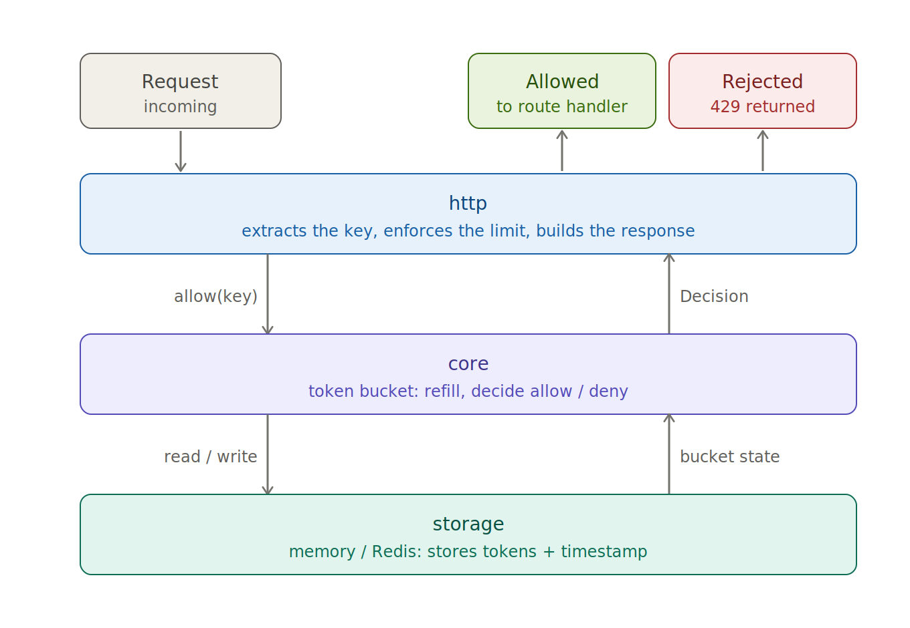
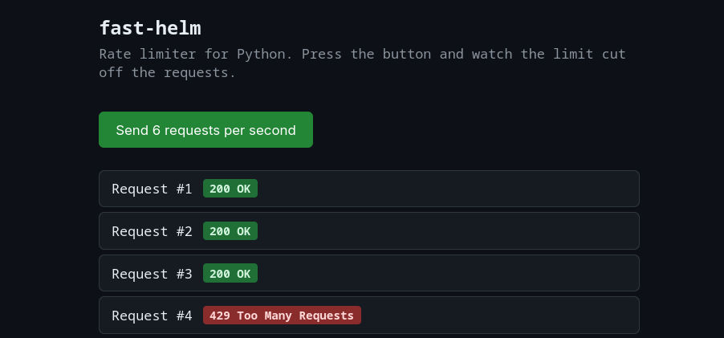

# FastHelm

A lightweight token bucket rate limiter for FastAPI, with a Redis backend for distributed, multi-instance limiting.


## Overview

Any public-facing API can be overwhelmed by too many requests in too little time, whether from a buggy client stuck in a retry loop, a scraper hammering an endpoint, an abusive actor, or simply more legitimate traffic than the backend can handle. Without a guardrail, a handful of callers can degrade the service for everyone, or run up costs that scale directly with request volume.

FastHelm sits in front of your FastAPI routes and answers one question per request: *allow it, or reject it?* It uses the token bucket algorithm, which enforces an average rate while still permitting short, controlled bursts. The natural shape of real API traffic.

The core logic is decoupled from the storage backend, so the same limiter runs on an in-memory backend during local development and on Redis in production without any change to the business logic or the HTTP layer. It starts simple and single process in memory. Scales up to a distributed setup where several API instances share one Redis and stay correct under concurrency through an atomic Lua script.

### Simple request flow 




## Features

- **Token bucket with lazy refill** — enforces an average rate while allowing controlled bursts; no background threads or timers, tokens are recomputed from elapsed time on each request.
- **Swappable storage backends** — in-memory (lock-based, single instance) and Redis (distributed).
- **Atomic Redis limiting** via a Lua script, so the read-decide-write cycle stays race-free across multiple instances.
- **FastAPI integration** as middleware or a route dependency.
- **Standard HTTP semantics** — `429 Too Many Requests` with `Retry-After` and `X-RateLimit-*` headers.
- **Flexible keying** — limit by client IP, API key, or a custom key function.

## Try the example app

`example/app.py` is a small FastAPI app with a web page: press a button, it fires 6 requests in one second, and you watch the limiter let the first few through and reject the rest with `429`.



The quickest way to run it is Docker Compose, which starts Redis and the app together:

```bash
docker compose up --build
```

Then open http://localhost:8000 and press the button.

To run it without Docker, start a Redis instance, then launch the app with Poetry:

```bash
poetry install
poetry run uvicorn example.app:app --reload
```

The app reads `REDIS_URL` from the environment and falls back to `redis://localhost:6379`.

## Use the library

Install it into your own FastAPI project (it builds as `fast-helm`):

```bash
pip install fast-helm
```

Pick a backend, build a limiter, and attach it. There are two ways to wire it in.

**As a per-route dependency** — apply the limit to specific endpoints:

```python
from fastapi import FastAPI, Depends
from redis.asyncio import Redis

from fasthelm.storage.redis import RedisTokenBucket
from fasthelm.http.dependencies import RateLimit

app = FastAPI()

redis = Redis.from_url("redis://localhost:6379")
limiter = RedisTokenBucket(redis, capacity=3, refill_rate=1.0)
rate_limit = RateLimit(limiter)  # default keying: per client IP

@app.get("/api/ping", dependencies=[Depends(rate_limit)])
async def ping():
    return {"status": "ok"}
```

**As middleware** — apply the limit to every route:

```python
from fasthelm.http.middleware import RateLimitMiddleware

app.add_middleware(RateLimitMiddleware, limiter=limiter)
```

For local development without Redis, swap in the in-memory backend — same logic, single process, no external dependency:

```python
from fasthelm.core.token_bucket import TokenBucket
from fasthelm.storage.memory import MemoryStorage

limiter = TokenBucket(MemoryStorage(), capacity=3, refill_rate=1.0)
```

`capacity` is the burst size (the most requests allowed at once) and `refill_rate` is the sustained rate in tokens per second. Pass `key_func=...` to either `RateLimit` or `RateLimitMiddleware` to limit by API key or a custom key instead of client IP.

## Public API

These are the names intended for use from your own code, grouped by layer.

### Limiters

A limiter is anything that implements the `RateLimiter` protocol — a single `async check(key, cost=1)` method that returns a `Decision`. Two are built in:

- `TokenBucket(storage, capacity, refill_rate, now=time.monotonic)` — `fasthelm.core.token_bucket`. In-process limiter; pairs with a storage backend.
  - `await check(key, cost=1) -> Decision` — refill, decide, and persist the bucket for `key`.
- `RedisTokenBucket(redis, capacity, refill_rate)` — `fasthelm.storage.redis`. Distributed limiter backed by an atomic Lua script; takes a `redis.asyncio.Redis` client.
  - `await check(key, cost=1) -> Decision` — same contract, evaluated atomically in Redis.

### Storage backends

Passed to `TokenBucket`. Any object satisfying the `Storage` protocol (`fasthelm.storage.base`) works:

- `MemoryStorage()` — `fasthelm.storage.memory`. In-process, lock-based state for a single instance.

### HTTP integration

- `RateLimitMiddleware(app, limiter, key_func=client_ip_key)` — `fasthelm.http.middleware`. ASGI middleware that limits every route; attach with `app.add_middleware(...)`.
- `RateLimit(limiter, key_func=client_ip_key)` — `fasthelm.http.dependencies`. Callable FastAPI dependency for per-route limiting; use with `Depends(...)`.
- `client_ip_key(request) -> str` — `fasthelm.http.middleware`. Default key function; one bucket per client IP. Supply your own `key_func` to limit by API key or a custom value.
- `rate_limit_headers(decision) -> dict[str, str]` — `fasthelm.http.responses`. Builds the `X-RateLimit-*` headers from a `Decision`.
- `too_many_requests(decision) -> JSONResponse` — `fasthelm.http.responses`. A ready-made `429` response with `Retry-After` and rate-limit headers.

### Result type

- `Decision` — `fasthelm.core.limiter`. Frozen dataclass returned by every limiter, with fields `allowed`, `limit`, `remaining`, `reset_after`, and `retry_after`.

## Tech stack

- Python 3.14+
- FastAPI
- Redis
- Poetry (dependency and environment management)
- pytest

## Project structure

The code is split into three independent layers — business logic, storage, and HTTP — each depending only on the interfaces of the layer below it.

```
fasthelm/                # the importable package
│
├── core/                # business logic — pure algorithm, no I/O
│   ├── limiter.py       # RateLimiter protocol + Decision result
│   └── token_bucket.py  # token bucket with lazy refill
│
├── storage/             # state backends behind a common protocol
│   ├── base.py          # Storage protocol
│   ├── memory.py        # in-process, lock-based (single instance)
│   └── redis.py         # distributed backend + atomic Lua script
│
└── http/                # FastAPI integration layer
    ├── middleware.py    # request keying + limit enforcement
    ├── dependencies.py  # per-route dependency variant
    └── responses.py     # 429 response + rate-limit headers

example/
 └── app.py          # demo FastAPI app — wiring + a sample endpoint
   
tests/
pyproject.toml
poetry.lock
README.md
```

The dependency direction is one-way: `http` knows about `core`, `core` knows about `storage` only through its protocol, and `core` never imports anything from `http`. That boundary is what lets you swap the storage backend — memory for Redis — without touching the limiting logic or the HTTP layer.